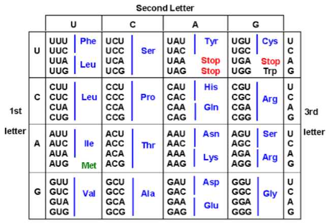

```{r setup, include=FALSE}
knitr::opts_chunk$set(echo = TRUE)
```

## Ejercicios en R

1. Escribe una función que genere una secuencia aleatoria de DNA de tamaño “n”.
```{r}
n <- readline("Ingresa el tamaño de la secuencia: ")

# Funcion generar la secuencia
generarAdn = function(n){
  bases <- c("A", "T", "C", "G")
  sample(bases, n, TRUE)
}

chain <- generarAdn(n)

```
2. Codifica una función que calcula el tamaño de una secuencia de DNA.
```{r}
# Funcion para calcular el tamaño de la secuencia
sizeDna <- function(chain){
  length(chain)
}
```
3. Crea una función que recibe una secuencia de DNA e imprime el porcentaje de cada base en la 
secuencia.
```{r}
# Funcion para calcular el porcentaje de cada base nitrogenada
percentageBase <- function(chain){
  size <- sizeDna(chain)
  bases <- c("A", "T", "C", "G")
  percentages <- numeric(4)
  for (el in chain) {
    for (i in 1:4){
      if (el == bases[i]) percentages[i] <- percentages[i] + 1
    }
  }
  for (i in 1:4){
    percentages[i] = percentages[i] / size
  }
  percentages
}
percentageBase(chain)
```

5. Crea una función que traduce una secuencia de RNA a una secuencia de proteínas, usa la siguiente tabla. 

```{r}
# Funcion para concatenar la cadena
concat = function(chain){
  clean <- character()
  for(l in chain){
    clean <- paste(clean, l, sep="")
  }
  clean
}

prot = function(codon){
  switch(codon, 
         "UUU" = "Phe", "UUC" = "Phe", "UUA" = "Leu", "UUG" = "Leu", 
         "CUU" = "Leu", "CUC" = "Leu", "CUA" = "Leu", "CUG" = "Leu", 
         "AUU" = "Ile", "AUC" = "Ile", "AUA" = "Ile", "AUG" = "Met", 
         "GUU" = "Val", "GUC" = "Val", "GUA" = "Val", "GUG" = "Val", 
         "UCU" = "Ser", "UCC" = "Ser", "UCA" = "Ser", "UCG" = "Ser", 
         "CCU" = "Pro", "CCC" = "Pro", "CCA" = "Pro", "CCG" = "Pro", 
         "ACU" = "Thr", "ACC" = "Thr", "ACA" = "Thr", "ACG" = "Thr", 
         "GCU" = "Ala", "GCU" = "Ala", "GCA" = "Ala", "GCG" = "Ala", 
         "UAU" = "Tyr", "UAC" = "Tyr", "CAU" = "His", "CAC" = "His", 
         "CAA" = "Gin", "CAG" = "Gin", "AAU" = "Asn", "AAC" = "Asn",
         "AAU" = "Asn", "AAC" = "Asn", "AAA" = "Lys", "AAG" = "Lys",
         "GAU" = "Asp", "GAC" = "Asp", "GAA" = "Glu", "GAG" = "Glu",
         "UGU" = "Cys", "UGC" = "Cys", "CGU" = "Arg", "CGC" = "Arg",
         "CGA" = "Arg", "CGG" = "Arg", "AGU" = "Ser", "AGC" = "Ser",
         "AGA" = "Arg", "AGG" = "Arg", "GGU" = "Gly", "GGC" = "Gly",
         "GGA" = "Gly", "GGG" = "Gly", "AUG" = "Met", "-")
}

rnaProt = function(chain){
  if(class(chain) != "character")
    chain <- concat(chain)
  for(i in 1:nchar(chain)){
    
  }
}
```
